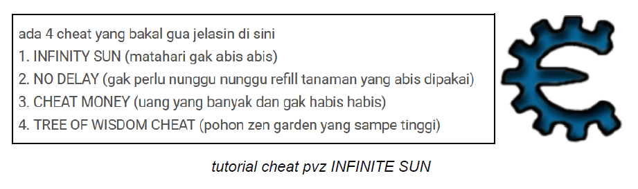

# Citer

# Ketentuan

Buatlah sebuah program memory editor sederhana yang akan mengedit memory target program dengan value yang lain. 

Environment target dibebaskan, tetapi template diatas hanya dapat digunakan untuk environment Win32. API Process & Virtual Memory setiap environment dapat berbeda-beda. 

Untuk target Win32, gunakan Visual Studio Community C++ Console Project untuk mempermudah development.

# Tujuan
- Merasa menjadi hekel setelah mengecit sun
- Mengetahui API Process & Virtual memory
# Berkas
- Source code
- Dokumen berisikan eksekusi program memory editor
# Referensi
- https://docs.microsoft.com/en-us/windows/win32/api/memoryapi/nf-memoryapi-readproc
essmemory
- https://docs.microsoft.com/en-us/windows/win32/api/memoryapi/nf-memoryapi-writeproc
essmemory
- https://github.com/cheat-engine/cheat-engine
- https://docs.microsoft.com/en-us/windows/win32/procthread/process-enumeration
- https://www.linuxquestions.org/questions/programming-9/reading-proc-pid-mem-462646/
# Tabel Pengerjaan
|          Task                |Status|
|------------------------------|------|
|Source code                   |  V   |
|Dokumen: eksekusi program     |  V   |
