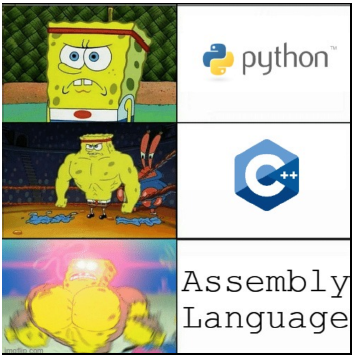

# Low Level Calculator

# Ketentuan
Membuat sebuah kalkulator menggunakan bahasa C atau C++ yang hanya bolehmenggunakan operator bitwise: &, |, ^, ~, <<, >>, >>>. Operand adalah integer 4 byte.
Kalkulator harus dapat melakukan operasi:
- Penjumlahan
- Pengurangan
- Perkalian
- Pembagian
Implementasi tidak boleh menggunakan keyword while dan for, tetapi goto dan label diperbolehkan. Fungsi antara untuk rekursi juga dilarang. Tidak ada order of operation, seluruh expression dievaluasi dari kiri ke kanan. Khusus untuk keperluan I/O diperbolehkan untuk menggunakan library I/O dan keyword while.
# Bonus
- (Poin 1) Melakukan operasi pangkat
- (Poin 1) Melakukan operasi 1/sqrt(x) (output boleh floating point, input tetap integer 4 byte)
- (Poin 1) Menggunakan bahasa Rust (interop dengan C/C++ untuk keperluan label dan goto)
# Tujuan
- Menderita dengan bitwise operator
- Menjadi low-level enjoyer
- Teracuni oleh Quake 3
# Berkas
- Source code
- Dokumen berisi cara penggunaan program dan hasil percobaan setiap operator
# Tabel Pengerjaan
|          Task                |Status|
|------------------------------|------|
|Penjumlahan(+)                |  V   |
|Pengurangan(-)                |  V   |
|Perkalian(x)                  |  V   |
|Pembagian(/)                  |  V   |
|I/O                           |  V   |
|Parser                        |  V   |
|Pangkat(^)                    |      |
|1/sqrt(x)                     |      |
|Berkas:Source Code            |      |
|Berkas:dokumen:cara penggunaan|      |
|Berkas:dokumen:hasil percobaan|      |
