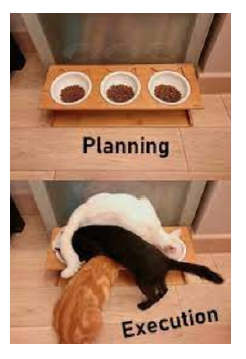

# Parallel universe String Finder

# Ketentuan
Buatlah sebuah program dengan ketentuan berikut
- Program memproses secara paralel
- File dicari secara multiprocessing
- String dalam file dicari secara multithreading
- Program menerima 1 input, yaitu string yang akan dicari
- Program bebas diimplementasikan menggunakan bahasa dan library bawaan untuk multithreading / process
# Bonus
- (Poin 3) Menggunakan OpenMPI, OpenMP atau CUDA
# Tujuan
- Belajar sispar (sister pre-UTS) sebelum yang lain
- Merasakan penderitaan race condition
# Berkas
- Source code
- Dokumen berisikan penjelasan singkat penggunaan program
# Tabel Pengerjaan
|          Task                |Status|
|------------------------------|------|
|Pencarian file multiprocessing|      |
|String dicari multithreading  |      |
|pakai OpenMP                  |      |
|Berkas:Source Code            |      |
|Berkas:dokumen:cara eksekusi  |      |
|Berkas:dokumen:penjelasan     |      |