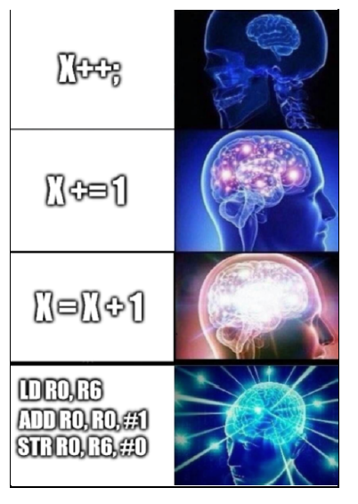

# Rakit

# Ketentuan
Buatlah sebuah program atau permainan sederhana dengan menggunakan asm x86. Program yang dibuat harus memiliki input dan output pada CLI.
# Bonus
- (Poin 1) Terdapat file I/O
- (Poin 2) Arsitektur selain x86
# Tujuan
- Memahami assembly
- Bisa berbicara dengan komputer, satu langkah lebih dekat untuk menikahi anime
- Bisa bikin OS saingan
# Berkas
- Kode sumber assembly yang dibuat
- Sebuah berkas dokumen yang berisi:
  - Cara eksekusi
  - Penjelasan singkat program
# Tabel Pengerjaan
|          Task                |Status|
|------------------------------|------|
|I/O program                   |      |
|bonus:File I/O                |      |
|bonus:arsitektur selain x86   |      |
|Berkas:Source Code            |      |
|Berkas:dokumen:cara eksekusi  |      |
|Berkas:dokumen:penjelasan     |      |