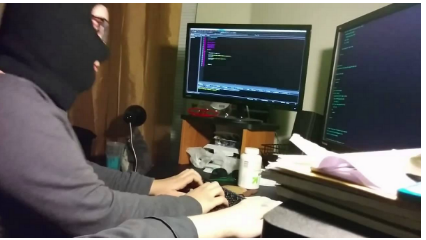

# Return-Oriented Programming

# Ketentuan
Kerjakan soal ROP pada pwn.college. Soal yang wajib dikerjakan adalah
- babyrop level1.0
- babyrop level2.0
# Tujuan
- Maen CTF lagi
- Mengetahui exploit ROP
# Berkas
- Dokumen berisi write-up singkat dari pengerjaan soal
# Tabel Pengerjaan
|          Task                |Status|
|------------------------------|------|
|Dokumen: writeup babyrop 1.0  |  V   |
|Dokumen: writeup babyrop 2.0  |  V   |