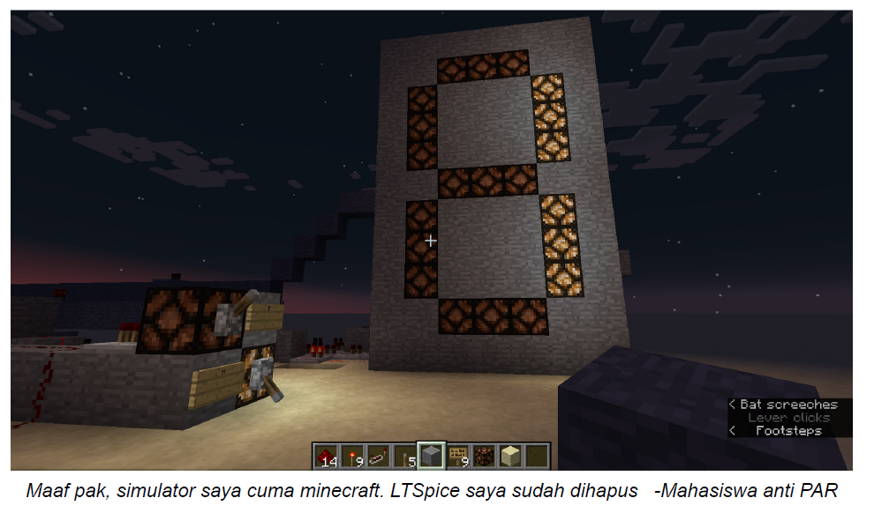

# Turing Machine 101

# Ketentuan
- Simulasikan 7-segment pada minecraft menggunakan redstone
- Untuk radix input dibebaskan, tetapi disarankan menggunakan binary untuk
memudahkan
- Input wajib dapat menerima nilai 0 hingga 9 dan output menampilkan 0 hingga 9 pada
7-segment
- Behaviour untuk nilai diluar 0-9 dibebaskan (dibiarkan, dimatikan, dinyalakan)
- Screenshot contoh menerima 2-bit input A dan B. Nilai A = 0, B = 1 sehingga output
pada 7-segment adalah bilangan 1 (Redstone lamp aktif membentuk 1)
- Tidak diwajibkan untuk menggunakan minecraft secara langsung, gunakan aplikasi
seperti redstone simulator jika tidak memiliki minecraft
- Jelaskan implementasi redstone logic gate pada dokumen
- Tips : Gunakan aljabar boolean dan pengetahuan logic gate adder
# Tujuan
- Simulasi logic gate pada aplikasi yang salah
- Mengetahui logic gate dan penerapan IF2120 Matematika Diskrit pada seleksi
laboratorium IRK (sister)
- Everything about this problem is wrong
- Kapan lagi masuk lab gara-gara redstone?
# Berkas
- Dokumen penjelasan implementasi logic gate
- Opsional : World minecraft dalam zip
# Tabel Pengerjaan
|          Task                |Status|
|------------------------------|------|
|7-segment                     |   V  |
|bonus: World Minecraft        |   V  |
|Berkas:implementasi logic gate|   V  |